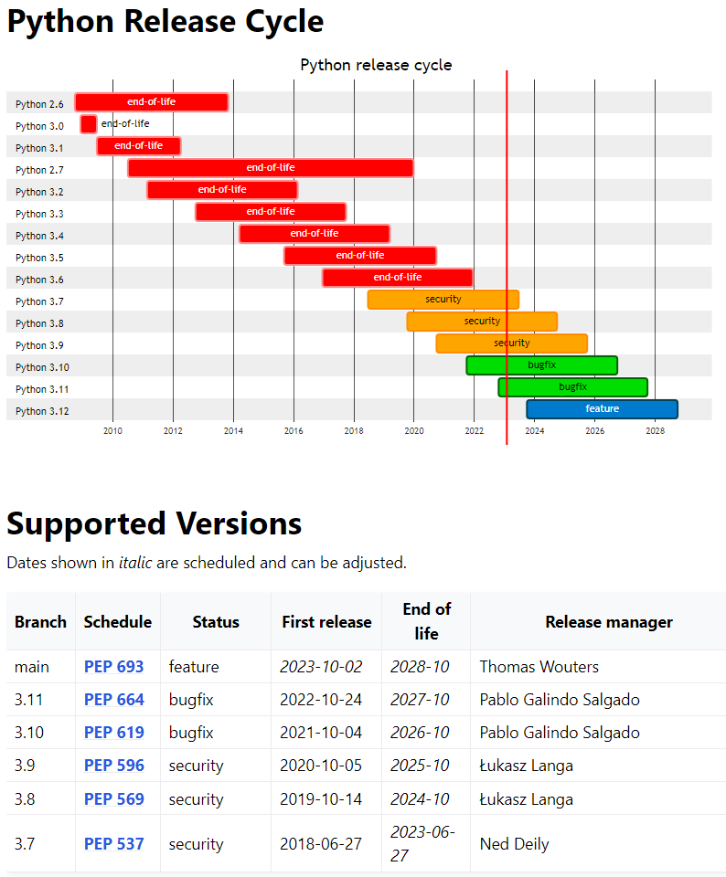
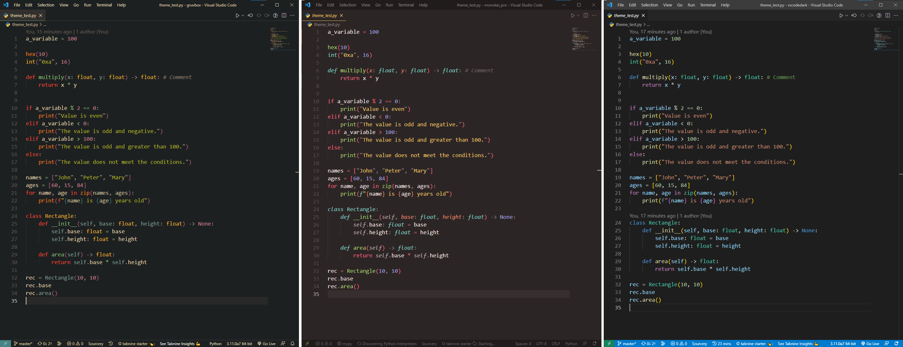

# Introducción - Entorno y Sugerencias

## Instalar Python

### Versión de Python

Source: https://devguide.python.org/#status-of-python-branches

Versiones anteriores: https://devguide.python.org/devcycle/#end-of-life-branches

## Software a Instalar

- Instalar Anaconda: https://www.anaconda.com/products/individual

- Instalar una fuente con ligatures (recomendada Fira Code): https://github.com/tonsky/FiraCode/wiki/Installing

- Instalar Visual Studio Code (VS Code): https://code.visualstudio.com/

- Elegir un Tema cómodo a los ojos (recomendado Monokai Pro y Gruvbox Dark)

### Extensiones Recomendadas para VS Code:

- Python (aprox 25.2M Descargas)

- vscode-icons (6.1M Descargas)

- Code Runner (aprox 4.9M Descargas)

- Python-autopep8 (206K Descargas)

- Pyright (51K Descargas)

- Polacode-2020 (25K Descargas)

Theme Recomendado (Personal): **Monokai Pro** o **Gruvbox**

## Configuración Custom de VS Code (settings.json):

- Usar CMD en lugar de Powershell:

      "terminal.integrated.shell.windows": "C:\\WINDOWS\\Sysnative\\cmd.exe"

- Reglas para guia

      "editor.rulers": [79, 120]

- Habilitar ligaduras (Sólo con Fira Code o similar)

      "editor.fontLigatures": true

## Capítulos

### 1. Tipos de datos primitivos y operadores.
### 2. Variables y Colecciones
### 3. Control de Flujo
### 4. Funciones
### 5. Classes
### 6. Módulos y estructura de imports
### 7. Aspectos avanzados del lenguaje
### 8. Recursos adicionales
### 9. Apéndices

## Fuente

Tutorial adaptado de https://learnxinyminutes.com/docs/es-es/python-es/
