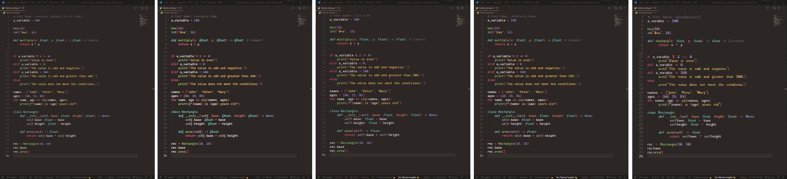

# Introduction - Environment and Tips

## Install Python

### Python Version

Source: https://devguide.python.org/versions/#versions

## Software to Install

- Install [PyEnv](https://github.com/pyenv/pyen), a tool that will manage
  different Python versions. (Windows users may use
  [PyEnv-Win](https://github.com/pyenv-win/pyenv-win))
- Install Visual Studio Code (VS Code): https://code.visualstudio.com/
- Choose a confortable theme to your liking. 

My recommendations in no particular order are (left to right in image below):

- Dark+ (Installed with VS Code)
- [Gruvbox](https://marketplace.visualstudio.com/items?itemName=jdinhlife.gruvbox)
- [Monokai Pro](https://marketplace.visualstudio.com/items?itemName=monokai.theme-monokai-pro-vscode)

- Choose a confortable font (potentially with ligatures).

My recommendations in no particular order are (left to right in image below):

- Consolas (Default font for VS Code)
- [Cascadia Code](https://github.com/microsoft/cascadia-code)
- [Fira Code](https://github.com/tonsky/FiraCode)
- [JetBrains Mono](https://github.com/JetBrains/JetBrainsMono)
- [OpenDyslexic](https://opendyslexic.org/)

### Recommended Extensions for VS Code:

Must Have:

- [Python](https://marketplace.visualstudio.com/items?itemName=ms-python.python): Language Support
- [Pylance](https://marketplace.visualstudio.com/items?itemName=ms-python.vscode-pylance): Automatic Type Checking
- [GitLens](https://marketplace.visualstudio.com/items?itemName=eamodio.gitlens): Git with batteries
- [VS Code Icons](https://marketplace.visualstudio.com/items?itemName=vscode-icons-team.vscode-icons): Nicer Icons

Optional
- [LiveServer](https://marketplace.visualstudio.com/items?itemName=ritwickdey.LiveServer): For live serving HTML/CSS/JS
- [Polacode](https://marketplace.visualstudio.com/items?itemName=jeff-hykin.polacode-2019): Easy screenshots of code with same style as editor
- [WakaTime](https://marketplace.visualstudio.com/items?itemName=WakaTime.vscode-wakatime): To track time based on project and language
- [SQLite](https://marketplace.visualstudio.com/items?itemName=alexcvzz.vscode-sqlite): Useful Database Viewer for SQLite
- [ThunderClient](https://marketplace.visualstudio.com/items?itemName=rangav.vscode-thunder-client): Postman-replacement for API Testing

## Custom VS Code configuration (settings.json):

- Enable AutoSave

      "files.autoSave": "afterDelay"

- Make sure that Pylance is checking your types:

      "python.analysis.typeCheckingMode": "strict"

- Rules for guide

      "editor.rulers": [79, 120].

- Enable ligatures (Only with Fira Code or similar).

      "editor.fontLigatures": true

- Move the activity bar to the right (personal choice)

      "workbench.sideBar.location": "right"

